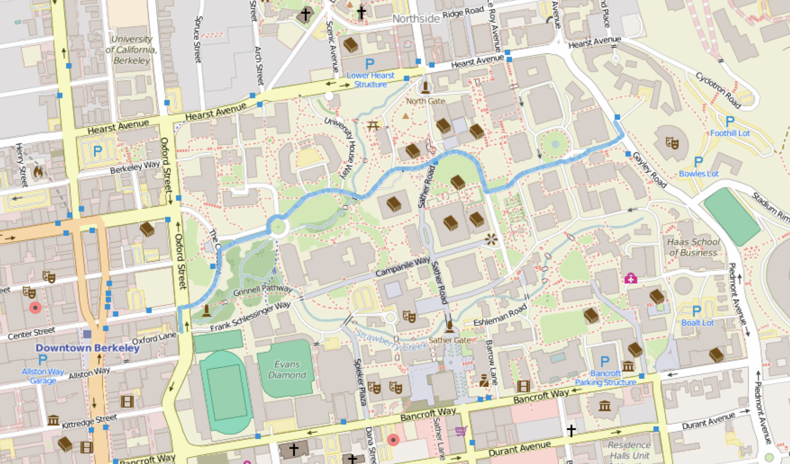
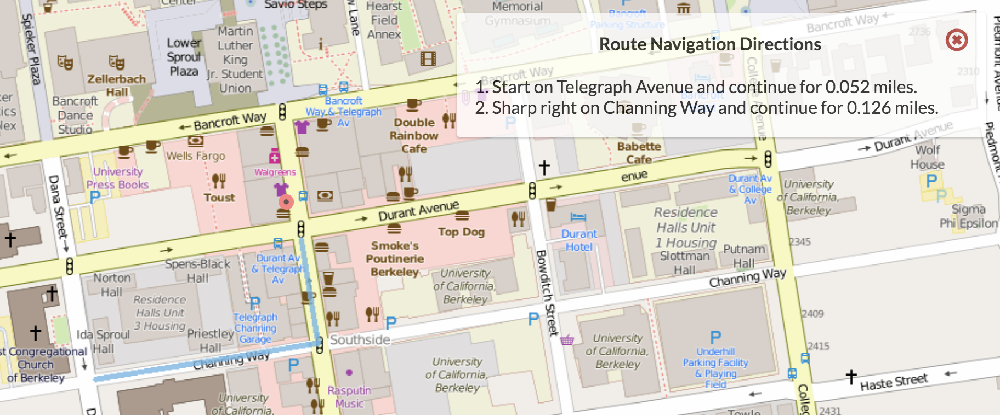
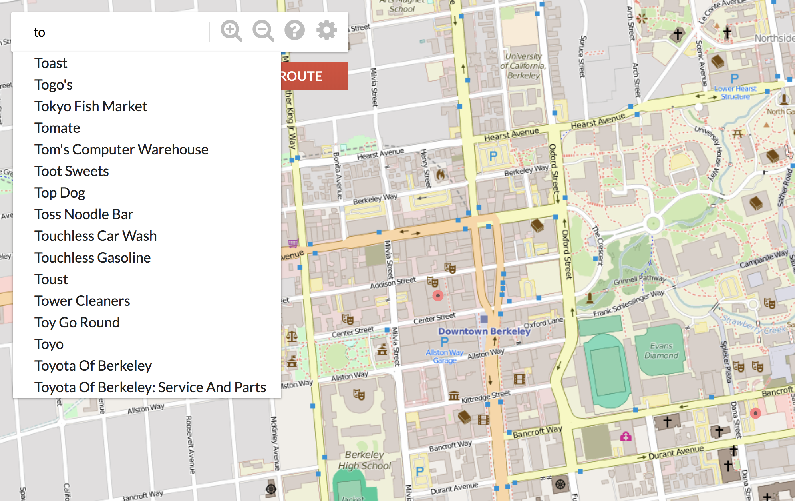

# Bear Maps

A mockup map service of Berkeley, CA. is developed using Java built under Maven. This is the 3rd project from the data structure class CS61B Spring 2018 from UC Berkeley.

## Supported Functions

Users can expect to use the following functions of the map:
* *Zoom in and zoom out on the map*
* *Search the shortest route from any starting point to a destination on the map*
* *Have turn by turn navigation while searching for the shortest path*
* *Search for any location (restaurants, coffee shops, etc.) with autocomplete*

## Examples

Some of the examples of how to interact with this map application is shown below.

### Finding the shortest route from point A to B

### Turn by Turn navigation

### Search location with autocomplete

